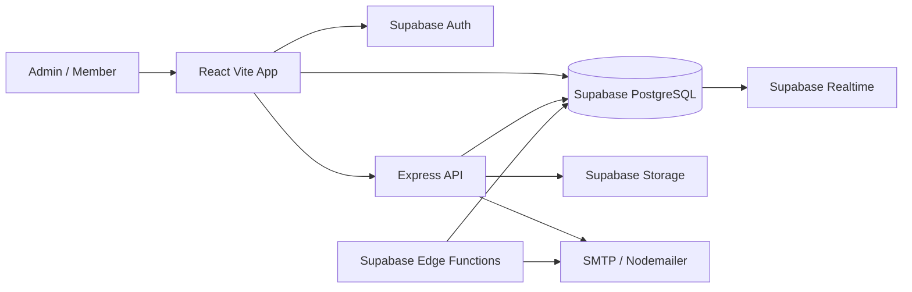

# Complete System Architecture

## Modules
1. Authentication & RBAC
2. Admin Dashboard
3. Member Dashboard
4. Member Management
5. Membership Plans
6. Payments & Approval Workflow
7. Ledger Engine
8. Late Fee Engine
9. Accounting
10. Reports & Export
11. Import/Migration
12. Receipts
13. Notifications
14. Announcements
15. Audit Logs
16. Backup & Recovery

## Architecture

## Security Model
- Supabase Auth handles identity.
- PostgreSQL Row Level Security protects member data.
- Admin-only server actions use Supabase service role key from the Express API or Edge Functions.
- Members can only read their own profile, ledger, receipts, notifications, and payments.
