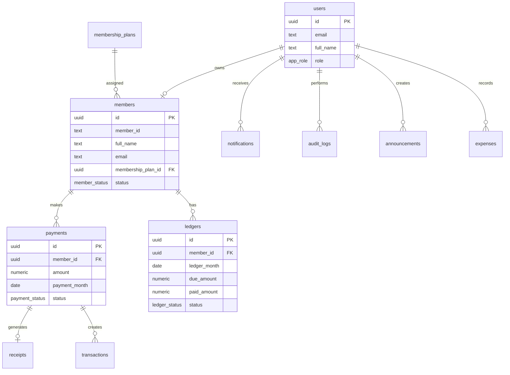

# Database ER Diagram

```mermaid
erDiagram
  users ||--o| members : owns
  membership_plans ||--o{ members : assigned
  members ||--o{ payments : makes
  members ||--o{ ledgers : has
  payments ||--o| receipts : generates
  payments ||--o{ transactions : creates
  users ||--o{ notifications : receives
  users ||--o{ audit_logs : performs
  users ||--o{ announcements : creates
  users ||--o{ expenses : records

  users {
    uuid id PK
    text email
    text full_name
    app_role role
  }
  members {
    uuid id PK
    text member_id
    text full_name
    text email
    uuid membership_plan_id FK
    member_status status
  }
  payments {
    uuid id PK
    uuid member_id FK
    numeric amount
    date payment_month
    payment_status status
  }
  ledgers {
    uuid id PK
    uuid member_id FK
    date ledger_month
    numeric due_amount
    numeric paid_amount
    ledger_status status
  }
```
